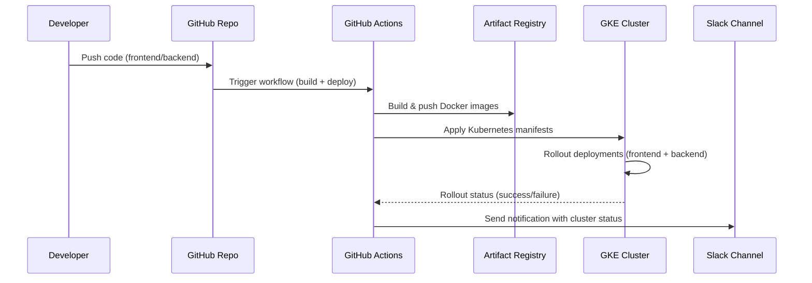
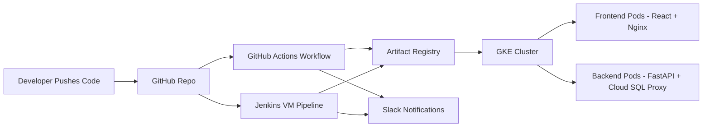

# Cloud Cost Optimizer – System Architecture

This document describes the architecture of the SaaS MVP. It highlights **security**, **scalability**, and **cost‑optimization** principles that make the system recruiter‑ and investor‑friendly.

---

## 🔧 High-Level Components

1. **Frontend (React + Tailwind)**
    - Runs in its own GKE node pool (`frontend-pool`).
    - Served via Nginx container.
    - Connects to backend API through Kubernetes service and ingress.

2. **Backend (FastAPI)**
    - Runs in its own GKE node pool (`backend-pool`).
    - Provides JWT authentication, AWS resource scanning, and savings calculation.
    - Connects securely to Cloud SQL Postgres via Cloud SQL Proxy sidecar.

3. **Database (Cloud SQL Postgres)**
    - Optional, controlled via Terraform toggle.
    - IAM‑based authentication and SSL/TLS enforced.
    - Secrets managed via Google Secret Manager and mounted into pods.

4. **CI/CD**
    - **GitHub Actions**: builds and pushes Docker images to Artifact Registry, deploys to GKE.
    - **Optional Jenkins VM**: hybrid CI/CD for enterprise scenarios.

5. **Infrastructure (Terraform + Kubernetes)**
    - GKE cluster provisioned with Terraform.
    - Separate node pools for frontend and backend workloads.
    - Kubernetes manifests define deployments, services, ingress, and secrets.

---

## 🔒 Security Features

- IAM roles for CI/CD service accounts.
- Secrets stored in Google Secret Manager, mounted via CSI driver.
- TLS/SSL enforced for database connections.
- Ingress routing isolates API and UI traffic.

---

## 📈 Scalability Features

- Stateless containers for frontend and backend.
- Separate node pools allow independent scaling.
- Kubernetes autoscaling and rolling updates.
- Ingress load balancer for global traffic distribution.

---

## 💰 Cost Optimization Features

- Lean instance types (`e2-medium`, `db-f1-micro`) for MVP.
- Autoscaling pools to avoid idle resources.
- Terraform toggles to enable/disable optional services (Cloud SQL, Jenkins VM).
- Artifact Registry for efficient image storage.

---

## 📊 Diagram Description

Visualize the architecture as follows:

- **User Browser** → hits **Ingress Load Balancer**.
- Ingress routes:
    - `/` → **Frontend Service** → **Frontend Pods (React + Nginx)** in `frontend-pool`.
    - `/api` → **Backend Service** → **Backend Pods (FastAPI + Cloud SQL Proxy)** in `backend-pool`.
- Backend connects to **Cloud SQL Postgres** (optional).
- CI/CD pipeline:
    - **GitHub Actions** builds/pushes images → **Artifact Registry**.
    - Deploys workloads to **GKE Cluster**.
    - Optional **Jenkins VM** for enterprise CI/CD.
- **Terraform** provisions GKE, node pools, Cloud SQL, Artifact Registry, IAM.

---

## 📌 Recruiter/Investor Notes

- **Secure**: IAM, Secret Manager, TLS.
- **Scalable**: GKE node pools, autoscaling, ingress.
- **Cost‑Optimized**: lean resources, toggles, autoscaling, efficient image storage.
- **Enterprise‑ready**: hybrid CI/CD, modular infra, reproducible Terraform setup.

## 🔄 CI/CD Pipeline Flow (Mermaid Sequence Diagram)

---

## ⚖️ CI/CD Comparison – GitHub Actions vs Jenkins

| Feature                | GitHub Actions                                | Jenkins VM (Optional)                          |
|-------------------------|-----------------------------------------------|------------------------------------------------|
| **Security**            | GitHub Secrets + IAM roles, no hard‑coded keys | IAM roles, RBAC, secrets stored in Kubernetes |
| **Scalability**         | Stateless workflows, parallel jobs, auto‑rollback | Enterprise integrations (LDAP, custom agents) |
| **Cost Optimization**   | Pay‑per‑use runners, lean builds, no idle VM costs | Optional VM only when needed, lean sizing     |
| **Ease of Use**         | Native GitHub integration, YAML workflows     | Customizable pipelines, modular shell scripts |
| **Best For**            | Lean startups, MVP deployments, rapid iteration | Enterprises needing hybrid CI/CD flexibility |
| **Deployment Target**   | GKE via Kubernetes manifests                  | GKE via Terraform + Jenkins pipelines         |
| **Maintenance**         | Zero infra overhead (managed by GitHub)       | Requires VM provisioning and patching         |

---

## 🖼️ CI/CD Architecture Diagram (Mermaid)

---

## 📌 Recruiter/Investor Highlights
- **GitHub Actions** → Lean, secure, cost‑optimized CI/CD for MVP and startups.
- **Jenkins VM** → Enterprise‑ready flexibility for hybrid CI/CD, optional to avoid unnecessary costs.
- Supporting both demonstrates **scalability and adaptability**: lean for MVP, enterprise‑ready for adoption.  
