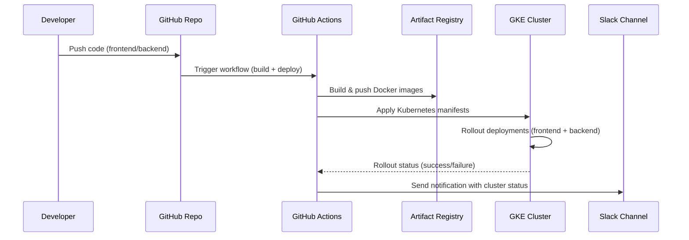
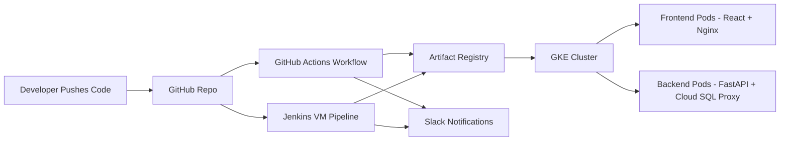

## 🔄 CI/CD Pipeline Flow (Mermaid Sequence Diagram)

---

## ⚖️ CI/CD Comparison – GitHub Actions vs Jenkins

| Feature                | GitHub Actions                                | Jenkins VM (Optional)                          |
|-------------------------|-----------------------------------------------|------------------------------------------------|
| **Security**            | GitHub Secrets + IAM roles, no hard‑coded keys | IAM roles, RBAC, secrets stored in Kubernetes |
| **Scalability**         | Stateless workflows, parallel jobs, auto‑rollback | Enterprise integrations (LDAP, custom agents) |
| **Cost Optimization**   | Pay‑per‑use runners, lean builds, no idle VM costs | Optional VM only when needed, lean sizing     |
| **Ease of Use**         | Native GitHub integration, YAML workflows     | Customizable pipelines, modular shell scripts |
| **Best For**            | Lean startups, MVP deployments, rapid iteration | Enterprises needing hybrid CI/CD flexibility |
| **Deployment Target**   | GKE via Kubernetes manifests                  | GKE via Terraform + Jenkins pipelines         |
| **Maintenance**         | Zero infra overhead (managed by GitHub)       | Requires VM provisioning and patching         |

---

## 🖼️ CI/CD Architecture Diagram (Mermaid)

---

## 📌 Recruiter/Investor Highlights
- **GitHub Actions** → Lean, secure, cost‑optimized CI/CD for MVP and startups.
- **Jenkins VM** → Enterprise‑ready flexibility for hybrid CI/CD, optional to avoid unnecessary costs.
- Supporting both demonstrates **scalability and adaptability**: lean for MVP, enterprise‑ready for adoption.  
